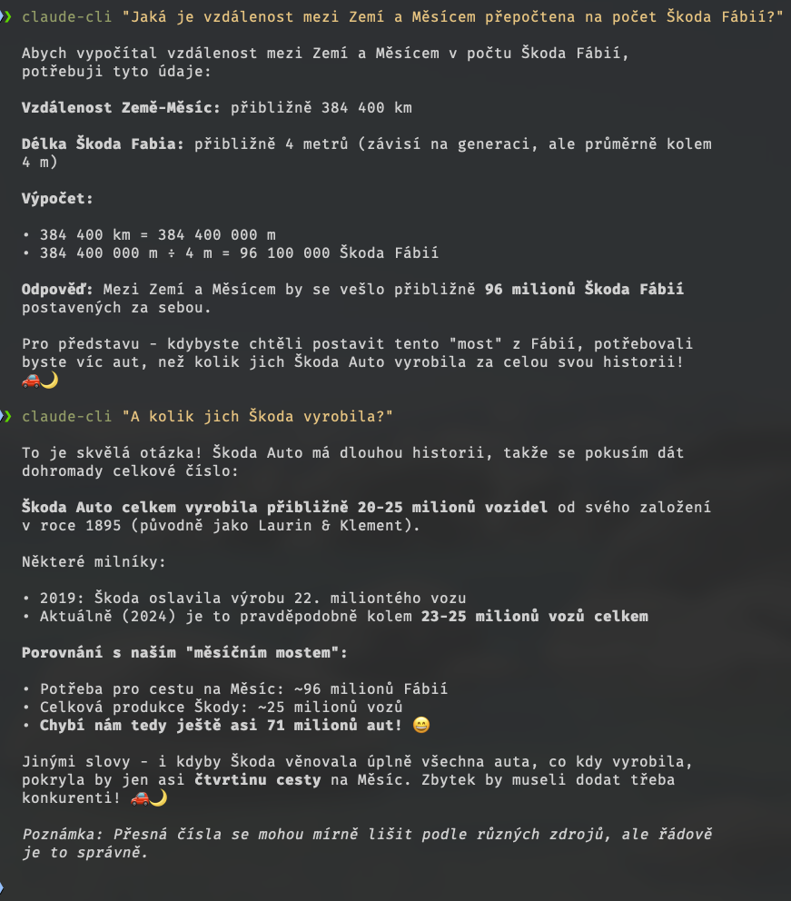

<a href="https://www.buymeacoffee.com/michalsara" target="_blank"></a>

# Claude-CLI

[🇺🇸 English](README.md) | [🇨🇿 Čeština](README.cs.md)

A simple CLI application for communicating with the Anthropic Claude API.

<p align="center">
  
</p>

## Installation

1. Download the `claude-cli` file: `curl -O https://raw.githubusercontent.com/MikeshCZ/claude-cli/main/claude-cli`
2. Make it executable: `chmod +x claude-cli`
3. (Optional) Move to PATH: `sudo mv claude-cli /usr/local/bin/`

> Alternative: On macOS you can use [Homebrew](https://brew.sh/) and [my 3rd party tap](https://github.com/MikeshCZ/homebrew-tap).

## Setup

1. Get an API key from https://console.anthropic.com/
2. Set the API key: `claude-cli -k YOUR_API_KEY`
3. (Optional) Set default model: `claude-cli -d MODEL_NAME`

## Requirements

- `curl` - for HTTP requests
- `jq` - for JSON processing
- `glow` - optional for better response formatting

### Installing Dependencies

**macOS:**
```bash
brew install jq glow
```

**Ubuntu/Debian:**
```bash
sudo apt-get install jq curl glow
```

## Features

- ✅ Simple queries to Claude API
- ✅ API key configuration
- ✅ Model selection for individual queries
- ✅ Default model setting
- ✅ Display current default model
- ✅ Display available models from API
- ✅ Markdown formatting of responses
- ✅ Context window for continuing conversations
- ✅ Persistent context window toggle on/off
- ✅ Conversation history stored in ~/.claude-cli-history
- ✅ Chat restart with history clearing
- ✅ Pipe input from stdin - supports command combinations with `|`
- ✅ Help

## Usage & Examples

```bash
# Basic query (uses default model)
claude-cli "What is the distance between Earth and Moon converted to the number of Škoda Fábias?"
claude-cli "What is artificial intelligence?"
claude-cli "Write a short poem"

# Using a specific model for one query
claude-cli -m claude-3-haiku-20240307 "Quick question"

# Show current default model
claude-cli --show-model

# Show available models from API
claude-cli --list-models

# Set default model (saved to configuration)
claude-cli -d claude-sonnet-4-0

# Enable context window permanently
claude-cli --context-toggle

# Check context window status
claude-cli --context-status

# Restart chat - clear history
claude-cli --context-restart

# Show help
claude-cli -h

# Set API key
claude-cli -k sk-ant-api03-...

# No formatting (raw markdown)
claude-cli --no-format "Show me markdown syntax"

# Pipe input from stdin
git log --oneline | head -5 | claude-cli "Translate these commit messages to Czech"
cat file.txt | claude-cli "Summarize the content of this file"
echo "Hello world" | claude-cli "Translate to Czech"

# Combination of pipe input with query
ls -la | claude-cli "Explain these files and directories to me"
```

## Pipe Input (Stdin)

Claude CLI supports receiving data through pipe (stdin), enabling easy integration with other commands:

### Usage Examples

```bash
# Pipe input only (no query)
cat document.txt | claude-cli

# Pipe input + query
git diff | claude-cli "Check these code changes"

# Project input, which is the same for these types of queries
cat project.txt | claude-cli "Question about this project"

# System commands with pipe
ps aux | claude-cli "Explain these processes to me. Is there anything suspicious?"
df -h | claude-cli "Evaluate disk status"

# Git commands
git log --oneline | head -10 | claude-cli "Summarize recent changes"
git status | claude-cli "What should I do with these changes?"

# Others
curl -s https://api.github.com/users/MikeshCZ | claude-cli "Summarize information about this user"
```

### How It Works

- Claude-CLI automatically detects if input is coming from pipe
- Pipe input is combined with query (if provided)
- If no query is provided, only pipe input is used
- Pipe input is displayed before the query, separated by an empty line

## Context Window

Claude CLI supports continuing conversations using a context window:

### How It Works

- **Default off**: Without activation, each query is independent
- **History is saved**: When enabled, conversation is saved to `~/.claude-cli-history`
- **Persistent setting**: Once enabled, remains active for all commands
- **Efficient token management**: Keeps only the last 20 messages for optimization
- **Security**: History is saved with 600 permissions (only owner can read)

### Enabling/Disabling Context Window

#### Permanent Activation (Recommended)

```bash
# Enable context window permanently
claude-cli --context-toggle

# Check if context window is enabled
claude-cli --context-status

# After enabling, all queries work with context automatically
claude-cli "Hello Claude!"
claude-cli "What did you say in the previous message?"

# Disable context window
claude-cli --context-toggle
```

#### Temporary Use

```bash
# Force context for this one query only
claude-cli --context-window "Your query with context"
claude-cli --context-window "What did I ask about?"

# Next query will be without context (if toggle is not enabled)
claude-cli "Normal query"
```

### History Management

```bash
# Clear conversation history
claude-cli --context-restart

# Check context window status
claude-cli --context-status

# Display conversation history file content
cat ~/.claude-cli-history
```

### Tip

- For convenient usage: `claude-cli --context-toggle` enables once, then you don't need to specify any parameters
- Check current status with `claude-cli --context-status` (returns ENABLED/DISABLED)
- For long-term conversations, we recommend occasional restart using `--context-restart` to maintain context relevance
- **Warning: with each query, history is also sent, increasing input token consumption!**

## Markdown Formatting

- **Glow**: If installed, it's used automatically (takes precedence over manual formatting below).

The application automatically colors and formats responses with the following elements:

### Headers

- `# Header` → ▶ **Header** (purple bold)
- `## Header` → ▶ **Header** (blue bold)  
- `### Header` → ▶ **Header** (cyan bold)
- `#### Header` → ▶ **Header** (white bold)

### Text Formatting

- `**bold text**` → **bold text**
- `*italic*` → *italic* 
- `~~strikethrough~~` → ~~strikethrough~~ (gray)
- `\`inline code\`` → `code` (white text on gray background)

### Blocks and Structures

- \`\`\`code block\`\`\` → green frame with language name
- `> quote` → yellow stripe with italic
- `- list` → cyan bullet •
- `1. numbered` → blue numbers
- `---` → horizontal line
- `[link](url)` → underlined blue text with URL

### Control

- **Default**: Color formatting enabled
- `--no-format`: Raw markdown without formatting

## 🧑‍💻 Author

- [More about the author](https://www.michalsara.cz)

## ☕ If you like this repository, you can **[buy me a coffee](https://www.buymeacoffee.com/michalsara)**. Thanks!
